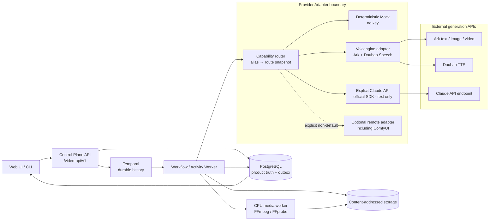
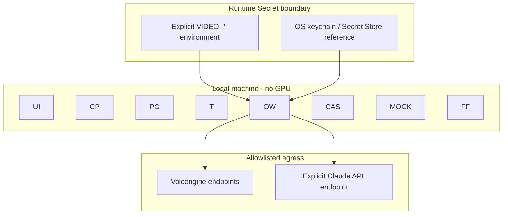

# API-first 总体架构

## 1. 冻结结论

系统采用“本地产品控制面 + 持久编排 + 远程 Provider API + 本地确定性媒体处理”：

- 本地不运行生成式模型，不要求 GPU，不下载权重；
- 文本、图片、视频、语音统一以能力别名调用 Provider Adapter；
- 火山引擎为首选路由，官方 Anthropic SDK 驱动的 Claude API 仅作为显式配置的文本备用；
- ComfyUI 若未来使用，只能是非默认、可替换的远程 adapter，不能成为启动前置；
- 无 Key 时 Control Plane、PostgreSQL、Temporal、CAS、Dry-run 和 Mock 全部可用；
- FFmpeg/FFprobe 可在 CPU 上执行下载校验、转码、拼接、混音、字幕和封装。

## 2. 组件图



## 3. 责任边界

| 组件 | 负责 | 明确不负责 |
|---|---|---|
| Web UI / CLI | 对象编辑、Dry-run、预算确认、G1/G2/Q1/G3、状态/成本展示 | 不持有 Key；不直连供应商、PG、Temporal 或文件卷 |
| Control Plane | 鉴权/RBAC、版本对象、幂等命令、预算预占、provider status、审计/outbox | 不在 HTTP 请求内等待长任务；不保存明文 Secret |
| PostgreSQL | Series/Episode/Scene/Shot、Context/Asset/Prompt revision、ProviderJob、Run/Attempt、Gate/QC、成本、Manifest | 不保存媒体字节、Temporal history 或可用凭证 |
| Temporal | 有向任务图、Activity retry、人工等待、取消、重启恢复、reconciliation | 不作为 UI 查询数据库；不保存供应商 Key |
| Capability Router | 将稳定 alias 解析为 provider/model/endpoint/capability 快照 | 不静默跨供应商切换；不篡改历史 route snapshot |
| Provider Adapter | SDK/HTTP 差异、能力探测、submit/poll/callback/cancel、错误归一、临时 URL 下载 | 不知道 Gate/RBAC；不决定预算；不泄漏 SDK 类型或上游原始错误 |
| CAS | 内容寻址、原子写、去重、checksum | 不保存“当前版本”业务关系 |
| CPU Media Worker | 规格归一、尾帧提取、拼接、混音、字幕、MP4 封装 | 不运行生成式推理 |
| Mock Provider | 固定响应、故障注入、幂等和异步契约测试 | 不代表真实生成质量/价格/SLA |

## 4. Provider 能力契约

领域层只依赖 `internal/videopipeline/provider.Adapter`：

```text
DiscoverCapabilities() -> []CapabilitySnapshot
Estimate(request) -> Estimate
GenerateText(request) -> JobResult
GenerateImage(request) -> JobResult
SubmitVideo(request) -> queued JobResult
GetVideoTask(taskID) -> JobResult
CancelVideoTask(taskID) -> accepted/unsupported/already-terminal
SynthesizeSpeech(request) -> JobResult
```

稳定能力别名：

| alias | 首选路由 | 可显式选择的备用 | 关键能力快照 |
|---|---|---|---|
| `text.primary` | 火山方舟 | Claude API、Mock | schema/streaming/context/usage |
| `image.primary` | 火山方舟图片 | 配置的兼容服务、Mock | references/size/seed/URL/Base64 |
| `video.primary` | 火山方舟视频 | 配置的兼容服务、Mock | ratio/duration/resolution/reference/tail/callback |
| `speech.primary` | 豆包 TTS | 配置的兼容 TTS、Mock | voice/emotion/speed/format/timestamps |

业务只保存 alias；每个 GenerationAttempt 同时冻结：

```text
provider_profile_id
actual provider
model_id / endpoint_id
route_version
capability_snapshot_hash
input_hash
upstream request_id / task_id
usage / actual cost / pricing version
```

路由更新只影响新 attempt。MVP 禁止单任务自动跨供应商降级；用户必须确认“重试原路由”或“复制为新 attempt 并换路由”，避免风格悄然变化。

## 5. 付费提交与异步时序

```mermaid
sequenceDiagram
    actor U as User
    participant CP as Control Plane
    participant PG as PostgreSQL
    participant T as Temporal
    participant A as Provider Adapter
    participant P as Remote Provider
    participant CAS as CAS

    U->>CP: Create generation plan
    CP->>PG: Read shots/assets/context/routes/budget
    CP->>A: Estimate(secret-free request)
    A-->>CP: units + amount range/unknown + pricing version
    CP->>PG: INSERT immutable plan
    CP-->>U: model, shots, calls, estimate, budget remainder
    U->>CP: Confirm plan
    CP->>PG: TX reserve upper bound + operation + outbox
    CP->>T: Start Workflow(plan hash)

    T->>A: Submit(jobId, inputHash, route snapshot)
    A->>PG: adapter repository persists intent/upstream mapping
    A->>P: create task (same idempotency key)
    P-->>A: task_id + queued
    A-->>T: providerJobId + task_id + QUEUED

    alt callback available
      P->>A: callback(callbackId, sequence, signature)
      A->>PG: dedupe + terminal monotonic update
    else polling
      T->>A: Get(task_id)
      A->>P: poll task_id
      P-->>A: running/succeeded/failed
    end

    alt result unknown
      A->>PG: UNKNOWN + task_id + next_poll_at
      Note over T,A: reconcile same task; never create a second paid task
    else succeeded
      A->>P: stream temporary output
      A->>CAS: MIME/size/checksum + atomic commit
      A->>PG: artifact + usage/cost + manifest mounts
      A-->>T: internal artifact descriptor
    else requires action
      A->>PG: auth/quota/safety/region/model action code
      A-->>T: non-retryable provider class
    end
```

关键事务顺序：

1. Control Plane 先持久化计划、预算预占、operation、idempotency、audit、outbox；
2. Provider Adapter 先持久化 submit intent，再调用上游；
3. 得到 task ID 后立刻持久化；超时则进入 `UNKNOWN`；
4. Activity retry、进程重启、callback/polling 复用同一 ProviderJob/JobID；
5. 临时下载 URL 只在 adapter 内存中消费，落 CAS 后不进入历史。

## 6. 网络与 Secret



- Claude 实现使用官方 Anthropic Go SDK，不使用 OpenAI-compatible shim；base URL/model/credential 仍必须显式配置；
- 允许的凭证来源只有显式 `VIDEO_*` 环境变量或 Secret Store reference；
- 禁止读取 `~/.claude`、Claude Code 配置或任意开发者文件；
- UI 只看 `provider_profile_id`、mask、fingerprint、health；
- 日志/trace/error/outbox/fixture/Manifest 采用字段 allowlist；
- `Authorization`、`api_key`、`token`、`cookie`、signed URL 必须在结构化边界被清除；
- 生产出站只允许配置的 Provider hostname；callback 要验签、限流和 body size。

## 7. 本地运行拓扑

默认 Compose 只有：

```text
postgres
temporal
migrate
mock-provider
orchestrator-worker
control-plane
optional temporal-ui
```

镜像不包含 CUDA、PyTorch、模型权重或 ComfyUI。进程以 `10001:10001` 运行、根文件系统只读、drop all capabilities、no-new-privileges。CAS/PG 使用独立 volume。

## 8. 前端实施边界

本 issue 不改现有前端，但 OpenAPI 已冻结前端可独立实现的视图：

- Provider 设置：capability status、mask/fingerprint、连接测试、route snapshot；
- 镜头生产：最终 Prompt、来源层、estimate、budget confirmation、ProviderJob/Attempt；
- 运行中心：`UNKNOWN/RECONCILING/REQUIRES_ACTION`、retry-after、建议动作、成本；
- 审批：G1 资产、G2 剧本、Q1 镜头、G3 成片；
- Manifest：provider/model/request/task、用量/费用、输入/输出 hash、资产/上下文/Prompt revision。
