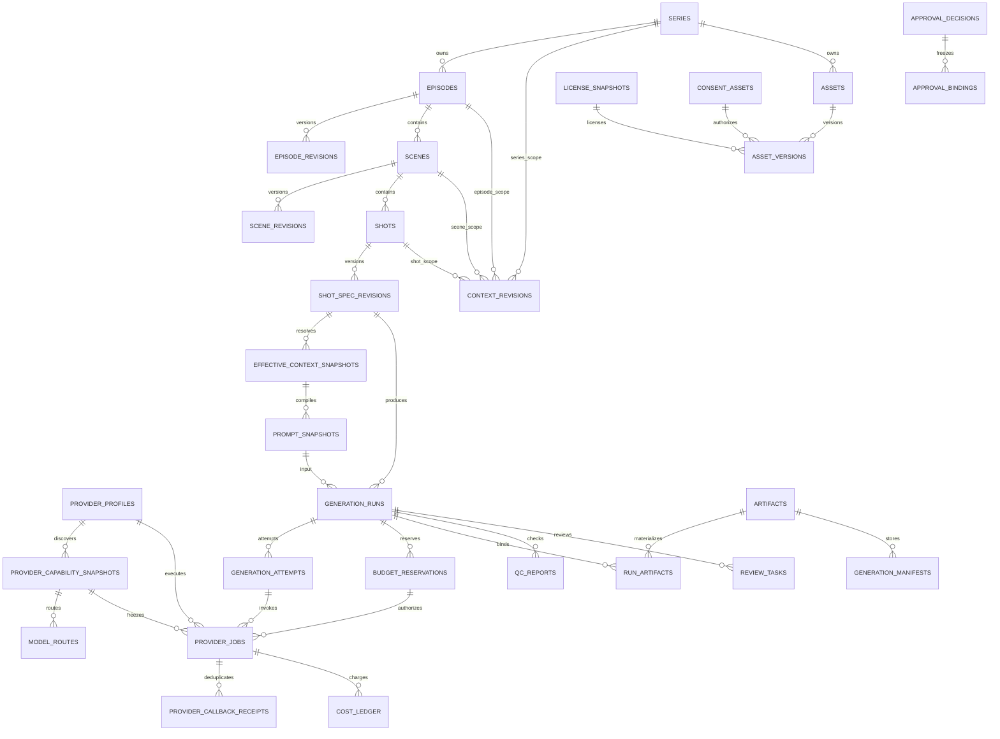

# 数据模型与数据字典

PostgreSQL schema 为 `video_pipeline`，与现有 Vibe Forge SQLite 完全隔离。媒体字节进入 CAS，Temporal 保存执行 history，PostgreSQL 保存可查询产品真相、Provider 外部任务映射、成本、审计与 outbox。

## 1. 核心 ER



## 2. 领域与版本对象

| 表 | 关键字段 | 不变量 |
|---|---|---|
| `series` | title/status/default profile/rights | 产品聚合根 |
| `source_revisions` | parent/revision/hash/CAS/rights | 小说原文只新增 revision |
| `episodes` / `episode_revisions` | ordinal/target duration/hash | 集身份与内容分离 |
| `scenes` / `scene_revisions` | ordinal/payload/hash | 场景内容可版本化 |
| `shots` / `shot_spec_revisions` | ordinal/duration/aspect/assets/context/continuity | 时长/比例在提交时对当前 capability snapshot 校验，不写死永久模型限制 |
| `entity_revisions` | WORLD/CHARACTER/RELATIONSHIP/LOCATION/PROP | Evidence 与改编新增显式 |
| `context_revisions` | scope/type/revision/payload | 剧集→单集→场景→镜头四层 |
| `effective_context_snapshots` | inputs/resolver/payload/hash | 每次 Prompt 使用不可变合并结果 |
| `prompt_snapshots` | template/context/assets/final payload/hash | 最终 Prompt、分段来源与结构化请求可 diff |
| `assets` / `asset_versions` | stable asset/type/version/CAS/source/rights | 新版本不覆盖被引用旧版 |
| `revision_dependencies` / `freshness_impacts` | producer→consumer | 递归 stale 与影响分析 |

所有 hash 是小写 SHA-256；CAS URI 为 `cas://sha256/{digest}`。

## 3. Provider 路由与任务

### `provider_profiles`

| 字段 | 含义 |
|---|---|
| `provider` | MOCK / VOLCENGINE / CLAUDE_COMPATIBLE / GENERIC |
| `base_url_ref` | 非敏感配置引用；不保存带签名 URL |
| `credential_ref` | Secret Store/环境变量引用，不是 Secret 值 |
| `mode` | MOCK / DRY_RUN / LIVE |
| `health` | NOT_CONFIGURED / UNKNOWN / READY / DEGRADED / UNAVAILABLE |
| `credential_fingerprint` | 不可逆指纹，可空 |
| `config_hash` | Secret-free canonical 配置 hash |

### `provider_capability_snapshots`

保存 alias、实际 model/endpoint、supported inputs、ratio/duration/resolution/concurrency 等 limits、pricing rule version、effective/expiry 和 capability hash。模型变化新增 snapshot。

### `model_routes`

保存 alias + route version + priority → capability snapshot。`automatic_failover=false` 为 MVP 默认；用户确认换供应商时创建新 attempt。

### `provider_jobs`

| 字段 | 含义/约束 |
|---|---|
| `generation_attempt_id` | 归属不可变创作 attempt |
| `provider_profile_id` | 实际 provider |
| `capability_snapshot_id` | 实际 model/endpoint 能力 |
| `budget_reservation_id` | submit 前已确认预算 |
| `idempotency_key` / `request_hash` | provider 内唯一；不同 hash 冲突 |
| `request_snapshot` | 脱敏结构化请求；禁止 Authorization/Key/signed URL |
| `upstream_task_id` / `upstream_request_id` | 重启恢复与 Manifest |
| `state` | DRAFT…UNKNOWN/REQUIRES_ACTION…terminal |
| `retry_count` | 仅基础设施 retry，0–3 |
| `next_poll_at` / `timeout_at` | reconciliation 调度 |
| `error_code` / `error_snapshot` | 统一类别和可操作建议 |

唯一约束：

- `(provider_profile_id, idempotency_key)`；
- `(provider_profile_id, upstream_task_id)`；
- successful/active run spec digest 唯一，阻止重复计费。

### `provider_callback_receipts`

主键 `(provider_job_id, callback_id)`；保存 sequence/payload hash/applied/ignored reason。原始签名 header 和可能含 Secret 的 body 不长期保存。

## 4. Run、Attempt、Artifact、QC、Gate

| 表 | 角色 |
|---|---|
| `generation_profiles` | 本地 CPU 媒体规则、能力 alias、QC/预算/许可策略，不含硬件类或本地模型 |
| `generation_runs` | 一次镜头创作输入；含 workflow、run digest、dry_run、budget approval |
| `generation_attempts` | 输入 hash、model snapshot、参数 diff；provider retry 不新建创作 attempt |
| `artifacts` | CAS hash/URI/MIME/size/media spec/状态 |
| `run_artifacts` | INPUT/OUTPUT/TAIL_FRAME/PROXY/AUDIO/SUBTITLE/MANIFEST |
| `qc_reports` | 技术/连续性/内容/音画结构指标 |
| `review_tasks` | SHOT(Q1)、G1/G2/G3、LICENSE、BUDGET |
| `approval_decisions` / `approval_bindings` | actor/reason + 精确 revision/hash |
| `generation_manifests` | Shot/Episode 全谱系和锁定 hash |

G1/G2/Q1/G3 都绑定具体 revision/hash；管理员不能绕过许可或 stale 检查。

## 5. 预算与成本

### `budget_reservations`

保存估算上界、currency、pricing version、完整 estimate payload、确认人/时间和状态：

```text
PENDING_CONFIRMATION → RESERVED → SETTLED | RELEASED
PENDING_CONFIRMATION → REJECTED
```

### `cost_ledger`

append-only 类型：`ESTIMATE`、`RESERVATION`、`ACTUAL`、`RELEASE`、`ADJUSTMENT`。金额未知时 `amount_minor/currency` 可空，但 units/unit/pricing version 必须保存；`verified=false` 防止把估值当实付。

成本可沿：

```text
cost ledger → provider job → generation attempt → run → shot → scene → episode → series
```

汇总到任一业务层级。

## 6. Manifest 最小字段

```json
{
  "schemaVersion": "v1",
  "seriesId": "...",
  "episodeRevisionId": "...",
  "shotSpecRevisionId": "...",
  "contextSnapshotId": "...",
  "assetRevisionIds": ["..."],
  "promptSnapshotId": "...",
  "provider": {
    "profileId": "...",
    "capabilityAlias": "video.primary",
    "modelId": "...",
    "endpointId": "...",
    "routeVersion": "...",
    "capabilityHash": "...",
    "requestId": "...",
    "taskId": "..."
  },
  "usage": {"inputUnits": 0, "outputUnits": 0, "unit": "..."},
  "cost": {"amountMinor": null, "currency": null, "pricingVersion": "...", "verified": false},
  "inputs": [{"artifactId": "...", "sha256": "..."}],
  "outputs": [{"artifactId": "...", "sha256": "..."}],
  "qcReportId": "...",
  "approvalDecisionIds": ["..."],
  "licenseSnapshotIds": ["..."],
  "aiDisclosure": true
}
```

禁止 Manifest 字段：API Key、Authorization、credential、临时 signed URL、原始 provider error body。

## 7. 原子事务

| 命令 | 同一事务 |
|---|---|
| 创建 revision | revision + dependencies + audit + outbox + idempotency response |
| 确认 plan | budget reservation + approval/audit + operation + outbox |
| Provider submit intent | provider job + attempt state + outbox |
| 接收 task ID | provider job state/task ID + attempt/run projection + audit/outbox |
| Callback | receipt + monotonic state + cost/output refs + outbox |
| CAS commit | artifact + run_artifact + provider job/run state + outbox |
| G3 lock | decision/bindings + manifest/artifact + episode state + audit/outbox |

外部 API 调用不在数据库事务中。采用 intent/outbox/idempotency/reconciliation 消除“双写即一致”的错误假设。

## 8. 删除、归档与保留

- revision 与成本 ledger 不物理覆盖；
- 被 Manifest/Gate/其他 revision 引用的 artifact 不删除；
- 上游临时 URL 不保存；
- 无引用下载/取消产物先标 `ORPHAN_CANDIDATE`，保留期后 GC；
- Secret 生命周期独立于项目数据库备份；
- idempotency、callback receipts、audit/outbox 设置合规保留与分区策略。
