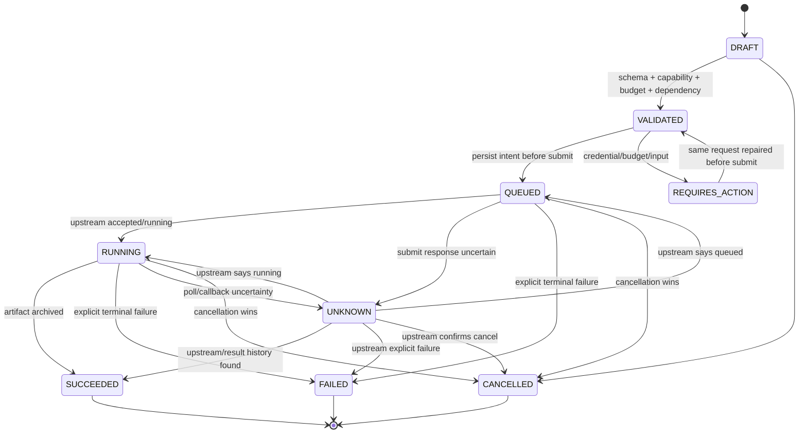
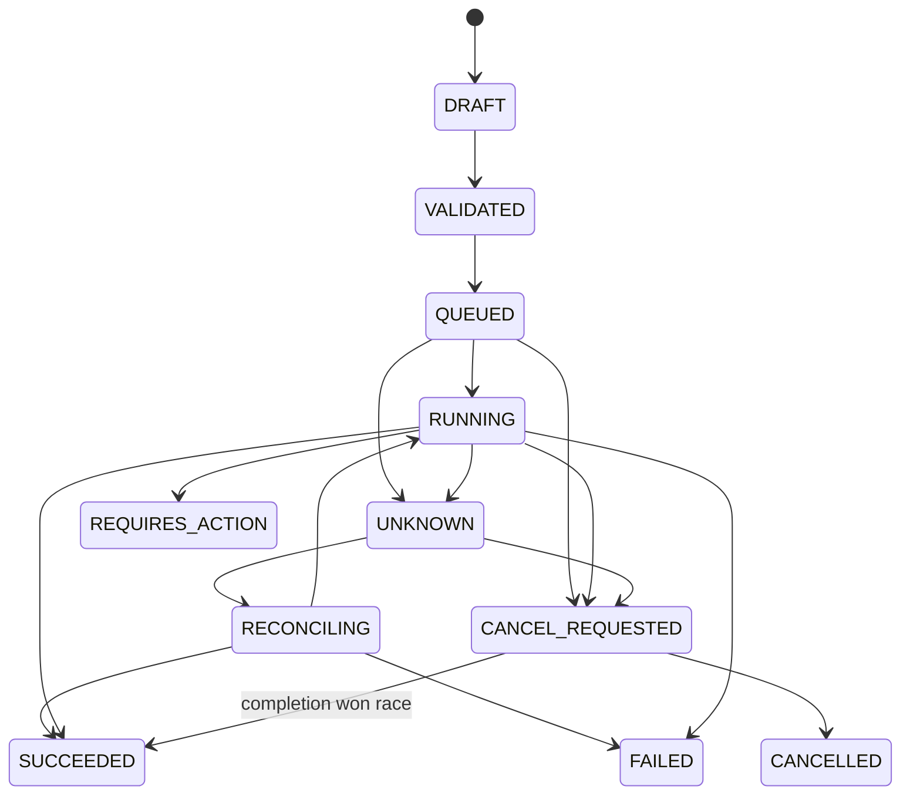
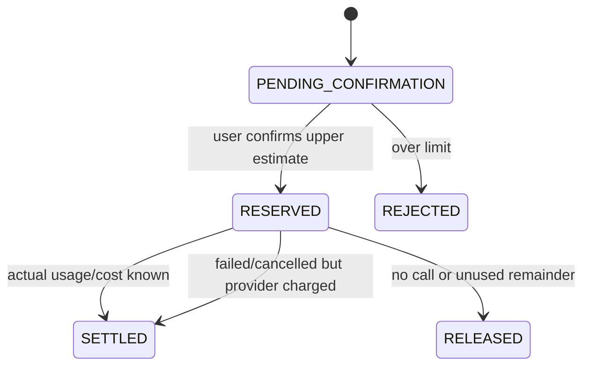

# 状态机、幂等、恢复与补偿

## 1. ProviderJob 状态机



终态是 `SUCCEEDED/FAILED/CANCELLED`。终态单调：重复或乱序 callback 不能把它退回 `RUNNING`。质量驳回不改变 ProviderJob 终态；用户修改 Prompt/资产/模型后创建新 GenerationAttempt。

## 2. Run 与 Attempt



- Run 表示一次创作输入版本；
- GenerationAttempt 冻结 input hash 与 model route snapshot；
- ProviderJob 表示一次外部计费任务；
- infrastructure retry 复用同一 ProviderJob/幂等键，不增加创作 attempt；
- Prompt、资产、上下文、参数或模型变化必须新建 attempt；
- 默认不自动跨供应商切换。

## 3. 幂等层次

| 层 | 键 | 相同键相同 hash | 相同键不同 hash |
|---|---|---|---|
| Public command | `(actor/scope, Idempotency-Key)` | 原 operation/response | `409 IDEMPOTENCY_CONFLICT` |
| Generation plan | canonical shots + routes + params + pricing | 原 plan | 新 plan |
| Run | run spec digest | 返回已存在 active/succeeded run | 新 run |
| ProviderJob | provider + capability + project/shot + input hash + model snapshot | 原 job/upstream task | 冲突，绝不覆盖 |
| Callback | provider job + callback ID + payload hash | 200/202 duplicate no-op | security event + reject |
| Artifact | SHA-256 content | CAS 去重 | 不适用 |

幂等键不能含 Key、signed URL 或不稳定字段。canonical request 使用稳定字段顺序、标准数字/Unicode 和内部 Artifact hash。

## 4. Provider 错误分类

| 统一错误 | 自动重试 | 状态/动作 |
|---|---:|---|
| `PROVIDER_RATE_LIMITED` | 是，最多 3 次 | 优先 `Retry-After`，否则指数退避+jitter |
| `PROVIDER_UNAVAILABLE` | 是，最多 3 次 | 同 JobID；达上限 `REQUIRES_ACTION` |
| 网络/TLS/可恢复 5xx | 是，最多 3 次 | 同 JobID；不可创建第二个付费任务 |
| submit/poll timeout | 否，不能判失败 | `UNKNOWN` → reconciliation |
| `PROVIDER_AUTHENTICATION_FAILED` | 否 | 更新显式 Secret/连接测试 |
| `PROVIDER_PERMISSION_DENIED` | 否 | 检查模型/Endpoint/区域权限 |
| `PROVIDER_QUOTA_EXHAUSTED` | 否 | 充值/配额/资源包 |
| `BUDGET_EXCEEDED` | 否 | 减候选/分辨率/镜头或重新批准预算 |
| `PROVIDER_CONTENT_BLOCKED` | 否 | 人工修改输入，禁止规避安全审核 |
| `PROVIDER_REGION_UNAVAILABLE` | 否 | 显式换区域/路由，新 attempt |
| `PROVIDER_MODEL_UNAVAILABLE` | 否 | 更新 route snapshot，新 attempt |
| `PROVIDER_INVALID_REQUEST` | 否 | 修正能力不兼容参数 |

Temporal Activity retry 策略：initial 1s、coefficient 2、max 30s、max 3。Provider `Retry-After` 优先于本地退避。Activity heartbeat 保存 phase、ProviderJob ID、upstream task ID、state、progress；不保存 Prompt 或 Secret。

## 5. UNKNOWN reconciliation

发生以下任一情况必须进入 `UNKNOWN`：

- 创建任务请求超时，不知道上游是否已创建；
- polling 超时或连接中断；
- callback 与 polling 结果冲突且无法确认终态；
- 下载成功但本地 commit 结果未知。

恢复顺序：

1. 用内部 ProviderJob ID 读取 PostgreSQL；
2. 若已有 CAS output/hash，直接核验并推进 `SUCCEEDED`；
3. 若有 upstream task ID，调用 get/history；
4. 若没有 task ID，使用供应商 idempotency/request ID 查询（若支持）；
5. 仍未知则保留 `UNKNOWN`、安排下一次对账并展示人工动作；
6. 禁止重新调用 create task，除非人工证明未创建并新建 attempt。

进程重启后 Temporal history 与 ProviderJob 表共同恢复；成功产物重复调用率目标为 0。

## 6. Callback 与 polling 并存

Callback receipt transaction：

```text
verify signature + timestamp
lookup provider job by profile/upstream task
INSERT callback receipt(callback_id, sequence, payload_hash)
if duplicate: commit no-op
if state terminal or sequence stale: mark ignored
else apply monotonic transition
write audit + outbox in same transaction
```

未知 callback 必须隔离，不能凭 payload 自动建立业务绑定。callback body 限制大小、记录 hash，不记录原始敏感 header。Polling 看到终态后，后到 callback 只能 no-op。

## 7. 取消与竞态

取消流程：

1. Control Plane TX 写 `CANCEL_REQUESTED`、actor/reason、audit/outbox；
2. Temporal 接收 cancel；
3. Activity 使用已保存 task ID 调用 provider cancel；
4. `accepted` 后继续 poll 直到 `CANCELLED` 或明确终态；
5. `unsupported` 保持 reconciliation，并告知可能继续计费；
6. 若完成先于取消，保存成功产物和实际费用，状态为 `SUCCEEDED`；
7. 已被业务引用的 CAS 产物不得物理删除；无引用产物标记 orphan candidate。

## 8. 预算与配额



- 项目、单次运行、单镜头重试三层上限；
- 先生成 plan，展示模型、镜头、候选、调用量、金额区间、预算余额；
- 价格未知时显示“金额未知”，强制人工确认，不伪造 0；
- 提交前预占估算上界；终态按实际结算并释放差额；
- provider 不返实际金额则保留 units、金额 `NULL`、`verified=false`；
- 批量默认并发 1，先跑一个 probe shot 再放量。

## 9. 补偿矩阵

| 故障点 | 可安全重做 | 禁止行为 | 补偿 |
|---|---|---|---|
| plan/预算 TX 前 | 全部 | 提交 provider | 无 |
| intent 已存、create 未响应 | query/reconcile | 盲目第二次 create | 同 idempotency key 查历史 |
| provider success、下载失败 | 重下临时 URL | 重跑生成 | poll/history 获新 URL |
| 下载完成、CAS commit 未知 | 按 hash 检查 | 重跑生成 | 原子 rename/去重 |
| callback 重复/乱序 | receipt no-op | 状态回退 | audit ignored reason |
| cancellation unknown | poll | 宣称已取消/不计费 | 标记可能费用 |
| QC 驳回 | 新 creative attempt | 覆盖旧产物/费用 | 保留旧 attempt |
| 时间线替换一镜 | 重建时间线 | 重生成其他镜头 | 复用锁定 artifacts |

## 10. 测试矩阵

Mock 固定场景：

| 场景 | 期望 |
|---|---|
| success / slow_success | queued→running→succeeded，CAS hash 稳定 |
| timeout | `UNKNOWN`，upstream task ID 保留 |
| unauthorized / forbidden | 不重试，`REQUIRES_ACTION` |
| rate_limited | Retry-After/退避，最多 3 次 |
| provider_unavailable | 5xx 同 JobID 重试 |
| quota_exhausted | 不重试，预算/配额动作 |
| content_blocked | 不重试，安全原因保留 |
| region/model unavailable | 不重试，新 route snapshot |
| duplicate_callback | 第二次 applied=false |
| out-of-order callback | 旧 sequence ignored |
| cancel_race | 成功终态不被取消回退 |
| recovery | 重启/Activity retry 复用 upstream task |
